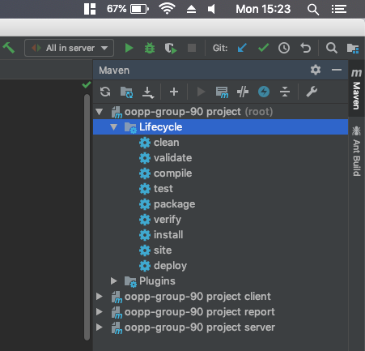
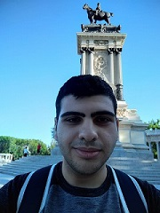
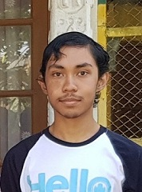
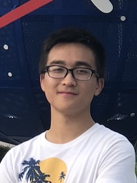
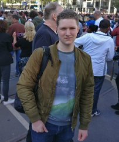

# #GoGreen

## Working with Maven
The Maven menu is located on the right side in IntelliJ.  
If you want to use them, run the stages inside the **'oopp-group-90 project (root)'** directory!  
See this image for a reference.

## Run the program
client: `$ java -jar client-[version nr].jar` 
server: `$ java -jar server-[version nr].jar`

## Run the tests
`$ mvn clean test`

## Getting release files
**IntelliJ**  
Doubleclick on 'install' in the Maven menu  
**Terminal**  
Run `$ mvn clean install`

**Build locations**  
client: `./client/target/client-[version].jar`  
server: `./server/target/server-[version].jar`

## Getting coverage report
**IntelliJ**  
Doubleclick on 'install' in the Maven menu  
**Terminal**  
Run `$ mvn clean test jacoco:report-aggregate` 

**Report location**  
`./tests/target/site/jacoco-aggregate/index.html` 

## Getting checkstyle report
**IntelliJ**  
Doubleclick on 'site' in the Maven menu  
**Terminal**  
Run `$ mvn clean site`  

**Report location**  
`./target/site/checkstyle-aggregate.html`

## Team members
* **Jules van der Toorn** (julesvandertoo)

    
    
    #### Personal development plan 
    First off, I would like to state my current strong points and weaknesses.
    
    ##### Strong points
    One of my general strong points is team leading, I'm good at listening to individual opinions and setting priorities for the team.
    Another one is encforcing goals, albeit in sports, schoolwork or programming.
    Lastly, when time allows it, I strive for perfectioning the details in my work.
    
    My strong points in programming include authentication, reliability, networking and algorithm design.
    
    An example of this can be found back in a project I did in high school.  
    I made a iOS app for the Dutch schoolsystem 'Magister'.
    I strived to publish it on the App Store, which as a result forced myself to eliminate all kinds of negative details, like bugs, inefficient code and non user-friendly UI elements.
    After learning how to deal with this and tackling all these obstacles, I've succesfully distributed the app on the [App Store](https://itunes.apple.com/nl/app/id1307145960 "Magistat on the App Store").
  
    ##### Weaknesses
    Ofcourse I also have my weaknesses.
    
    The strong point about perfectioning my work is also my biggest weakness.
    I always have the mindset that I **have** to get the task done that's in my head, knowing I can eventually get it done.
    
    This comes in many forms, e.g. finding the solution to a exam question, where I just can't allow myself to skip the current question if I get stuck. This often results in me spending way too much time on one exam question.   
    In programming I have this situation a lot when working on UI, where I can work 4 hours on the same detail, like making scrolling _just_ a bit smoother...
    
    This may sound contradictive to me stating that I know how to set priorities for the team, but that isn't true. In the back of my head I always know that I should just continue with a more important problem. It's just that I ignore that voice because I don't want to be a quitter.  
    I think that a big part of this problem can be avoided if I stay out of the front-end, but please critize me if you notice that I get side tracked during this project!
    
    ##### Personal goals
    My main goal for this project is learning how to work as a group on one software product, as I firmly believe that groups can create greater things than an individual.  
    Concretely, this includes properly learning git, knowing how to communicate and work with sprints, how to divide programming tasks and learning to make compromises.
    
    Secondly, I want to learn more about self-hosted user authentication, as I've only worked with 3rd party authentication before.
    
    Lastly, I want to reduce my perfectionism in critical time situations, where there is no flexibility to be stuck on the same problem for multiple hours.
    
    ##### Plans to reach personal goals
    In order to reach my goal of getting better at working in a group, I will do a lot of self-study about group work concepts, participate the best I can in the weekly meetings and be active in GitLab regarding code reviews.  
    
    To learn more about self-hosted user authentication, I will try to lead the authentication side of the project.  
    
    For my personal development goal, I will make clear plans of what I want to achieve per programming session, and primarily focus on that.
    I will periodically reflect on my own progress and listen greatly to the compliments/criticism of the team about my work. 

* **Rami Al-Obaidi** (ralobaidi)
    
    

    #### Personal development plan 
    
    My learning goal for this project are to understand how software development starts from scratch and to understand the different stages of software development. I am dedicated and hard working on achieving this goal.  I possess various skills that I believe will help me reach my goal. Some of these skills are judgmental, organizational and evaluative skills. I am slow learner and I think this will cause a problem when I try to learn new concepts needed to achieve my goal. I have started exploring the different ways that I can use to achieve my goal in this project. I believe that when working in a group will help me develop new skills and make me learn new things. I am currently working on improving my understanding of how client-server interactions which I believe is crucial to achieve my goal. I am also learning how to use Git, GUI frameworks and the libraries that I can use for the project.

* **Kevin Nanhekhan** (knanhekhan)
  
   
  
    #### Personal Development Plan:
    
    ##### Strong Points
    One of my strong points is that I'm always ready to learn something new.
    Another strong point of mine is that I will always try to understand the problem and do my best to solve it.
    
    ##### Weaknesses
    I'm not that much of a talker which can be quite an inconvenience when communicating with teammates.
    This also correlates to a second weakness of mine, namely not being fit for the role of leading the team or suggesting ideas.
    
    ##### Personal goals
    For my personal goals, I hope to learn how to communicate/work within a group in order to somewhat overcome my weaknesses.
    Secondly I hope to learn how to do similiar projects for the future, since this project higly resembles how real-world projects are being dome.
    Lastly, I want to improve my programming skills since I'm pretty much a beginner at object-oriented programming.
    
    ##### Plans to reach personal goals
    In order to reach my goals, I will try my best to search for ideas and bring them up during team meetings.
    For improving my programming skills, aside from doing a lot of self-study, I will try to learn from my teammates
    and I will also try to understand how the code, we as a team produce, works.

* **Yuxin Jiang** (yuxinjiang) 

    
    
    #### Personal development plan 
    First off, I would like to state my current strong points and weaknesses.
    
    ##### Strong points
    I consider myself as a good team worker, although I may not be a born leader, I am easy to communicate to and I am not afraid to voice my own opinion.

    Another strong point of me is that I am hardworking, if I take something serious, I will spare no effort into that and try to deliver the best result.
  
    ##### Weaknesses
    The biggest weakness of me is that I have no programming experience before so it may takes a longer time for me to get used to everything.

    ##### Personal goals
    My main goal of this project is to get familiar with the real-life programming system, try to figure out something I don't know before by myself, which will be a lot of fun for me.

    Besides, I also want to learn how to cooperate with others in programming, I think that is an important skill in my future career.
    
    ##### Plans to reach personal goals
    In order to achieve my goals, I will definitely do a lot of self-study, try to understand everything in the project.

    I will also try to be active in the group talk and deliver some valuable ideas.

* **Jonathan van Oudheusden** (jvanoudheusden)
      
    
      
    #### Personal development plan 
      
    ##### Strong points
    I am interested in this project and want to learn alot. 
    When I have something that doesn't work, I wil usually not stop till I get it to work.
      
    ##### Weaknesses
    I don't have alot of programming experience, so most of wat we wil have to do for this project wil be something I haven't done before.
     
    ##### Personal goals
    I want to be able to make more than just a text based program. I want to learn how to do everything involed with making a working program.
     
    ##### Plans to reach personal goals
    I wil do my part of the project and try to learn as much as I can, also I wil try to use the help from others with more experience than me.

* **Aleks Bako** (abako)
   
    
    
    #### Personal development plan
    
    ##### Strong points
    I'd say my strongest points are coding and structured planning.
    
    ##### Weaknesses
    I'd say one of my biggest weaknesses is that if i fall behind schedule i might take on more tasks than i can handle because of the time pressure between deadlines, which can lead to sloppy work.
    
    ##### Personal goals
    My personal goal is to improve at working in a team and my way of coding.
    
    ##### Plans to reach personal goals
    By sharing the work load with team mates and do research on what can be used when working with certain parts of the application.

* **Dimitar Petrov** (dpetrov)

    
   
    #### Personal development plan
    
    ##### Strong points
    My strong points are determination and teamwork. Working with more people has always made the project more fun and exciting. Also i always do my best to get things done and make the required results in a variety of different ways. I love exploring each part from a different perspective.
    
    ##### Weaknesses
    My weakness is lack of motivation sometimes. Often i'm not sure wether i am doing the right thing or not and get completely lost. I try to do my best, but sometimes i begin to wonder and spend a lot of time wasting starting the project/task.
    ##### Personal goals
    My personal goal is to develop skills in working in a real life situation. I want to practice as much as i can and start taking action, not just learning theoretical stuff. Also i like the freedom i have during the project, because now i can learn from many various recourses, not just by some small amount, that somebody else has told me. This way i starting to be more independent
    
    ##### Plans to reach personal goals
    Improving teammate skills and acquiring more knowledge, from the whole process. Understanding different points of views and different ways to tackle a problem is really imporant for me. 
