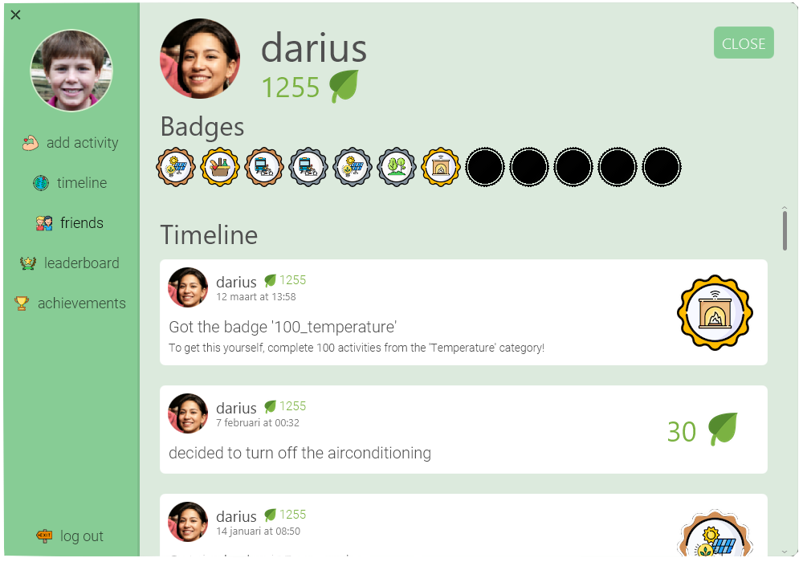

For the Assignment, read the pdf of the rubric.

# GoGreen  

## Introduction
    
  
   This is a java application which encourages people to live a more ecological lifestyle. It has two main components, client/GUI side
   and server side, users could create their own accounts, add "green" activities, send friend request to another user using graphical user interface, their requests 
   are sent to the server side, which will retrieve or insert corresponding data in the database. Every time the user fills in some "green" 
   activities, he will gain some green points. Between friends, they could compete with each other using their green points, which forms the 
   gamification aspect of our program.
                                                                                                   
   
## Look and feel
   
   
   As you can see, the profile picture of the user is shown on the top left of the screen, the user could click "add activity" button to add a "green" activity, timeline shows the history of his accomplished 
   activities. He could also check his friends' status in the friend channel. Leaderboard is for retrieving an overall performance of all his friends.
   Finally, achievements channel will show the badges he achieved so far.
   
## Running the program
Build the JAR files using  
`$ mvn clean install`  

Run the JAR files using   
- client: `$ java -jar client-[version nr].jar`  
- server: `$ java -jar server-[version nr].jar`

## Requirements
   Go Green requires the following to run:
   * JDK 1.8 or higher
   * JavaFX SDK 11.0.2 or higher

## Tests
There have been written tests for all non-GUI methods, currently covering more than 98% of all branches.  

Run the tests yourself using   
`$ mvn clean test`

## Credits
### Frontend
* **Jules van der Toorn**   
* **Kevin Nanhekhan** 
* **Dimitar Petrov** 

### Backend
* **Rami Al-Obaidi** 
* **Yuxin Jiang**  
* **Jonathan van Oudheusden**  
* **Aleks Bako** 
   

   
   